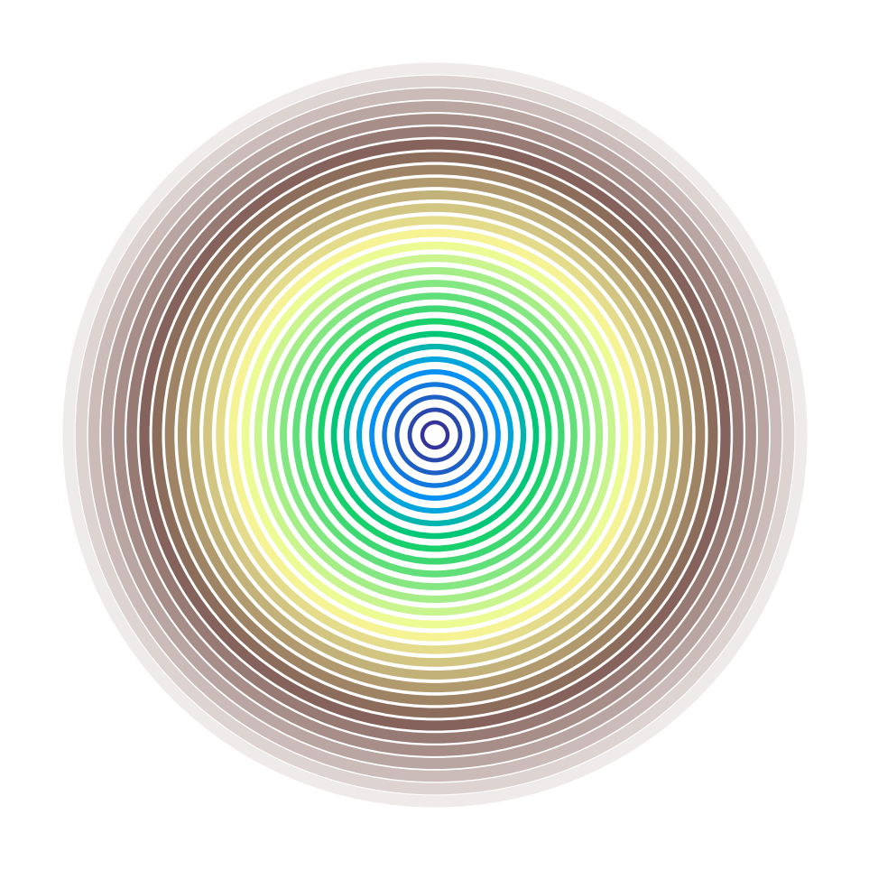

# 🎵🌳 Tree Ring Growth Animation

基于音乐韵律的树木年轮生长动画，展现自然生长与音乐的完美结合。

## ✨ 项目特色

- 🌳 **真实年轮数据** - 基于34年实际树木生长数据  
- 🎵 **音乐同步** - 与优美的自然主题音乐完美同步
- 🎨 **美丽可视化** - 1200x800高清图形界面
- 🎮 **交互控制** - 播放/暂停/重启等完整控制
- 💎 **纯净音质** - 无噪音的C大调自然音乐

## 🚀 快速开始

### 运行主程序
```bash
python gui_tree_ring.py
```

### 重新生成音乐
```bash
python simple_music_generator.py
```

## 📁 项目结构

```
Tree-Ring/
├── gui_tree_ring.py           # 🎵 主程序 - 图形化年轮动画
├── simple_music_generator.py  # 🎼 音乐生成器  
├── tree_ring_animator.py      # 🎨 动画引擎
├── data_generator.py          # 📊 数据生成器
├── tree_ring_data.json        # 📋 34年年轮数据
├── music/
│   ├── nature_simple.wav      # 🎵 自然主题音乐
│   └── README.txt             # 📄 音乐说明
├── tree_ring.png              # 🖼️ 项目截图
├── tree_ring.gif              # 🎬 动画演示
└── requirements.txt           # 📦 依赖包列表
```

## 🎮 操作说明

- **空格键** - 播放/暂停动画
- **P键** - 暂停/恢复音频  
- **R键** - 重新开始
- **Q键** - 退出程序

## 🔧 环境需求

```bash
pip install pygame numpy
```

## 🎵 音乐特点

- **🎼 C大调旋律** - 清晰悦耳的音符序列
- **🌿 自然节拍** - 75 BPM平静节奏  
- **✨ 和谐音效** - 主音+五度和声+装饰音
- **⏱️ 2分钟循环** - 无缝循环播放
- **💎 高音质** - 16位立体声WAV格式

## 📊 年轮数据

每个年轮包含：
- `year` - 年份 (1990-2023)
- `thickness` - 厚度 (2.0-3.0mm)  
- `density` - 密度 (0.2-0.8)

年轮会根据音乐节拍动态生长，强节拍时会有发光效果。

## 🖼️ 界面预览




---
🎵 享受音乐与自然生长的完美结合！ 🌳✨