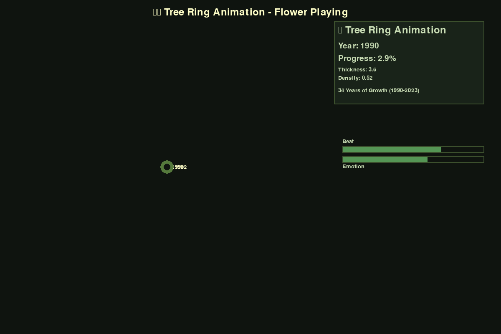
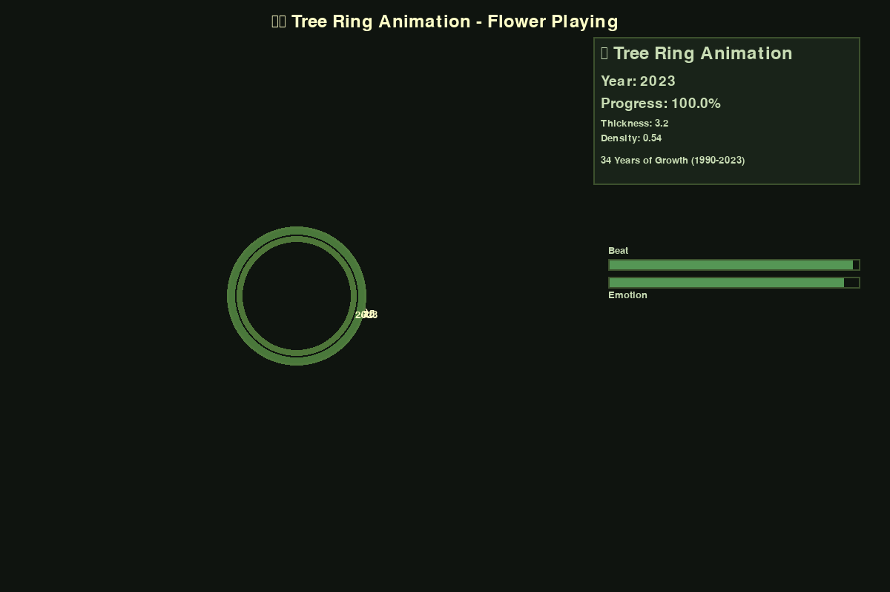

# 🌳 Tree Ring Animation - "Flower Playing"

一个优雅的树轮生长动画程序，结合自然音乐和真实环境数据，呈现树木34年（1990-2023）的生长历程。

## 📸 预览展示

### 🎬 动画效果


### 🖼️ 静态预览


## ✨ 核心特色

### 🎵 音乐与动画同步
- **纯自然音乐**：C大调和谐旋律，120秒循环播放
- **节拍同步**：树轮生长与音乐节拍完美同步
- **情感表达**：音乐情感强度影响树轮颜色变化

### 🌈 自然色彩系统
- **仿真色调**：棕色、绿色等自然树木色彩
- **同心圆设计**：清晰的年轮层次，无重叠
- **动态渐变**：基于环境因子的柔和颜色过渡

### 📊 真实数据模拟
- **34年数据**：1990-2023年树轮生长记录
- **环境因子**：厚度、密度、生长率、气候压力
- **年份同步**：与音乐节拍同步的年份显示

### 🖥️ 优化界面
- **1200x800分辨率**：清晰的视觉体验
- **实时信息面板**：年份、进度、生长数据
- **韵律可视化**：Beat和Emotion强度条（已修复重叠问题）
- **简单操作**：[空格]播放/暂停 [R]重启 [Q]退出

## 🚀 快速开始

### 环境配置
```bash
pip install pygame numpy
```

### 运行程序
```bash
python gui_tree_ring.py
```

**推荐选择选项2**：纯自然音乐版本，获得最佳体验！

## 📁 项目文件

```
🌳 Tree-Ring/
├── gui_tree_ring.py           # 🎯 主程序 - 完整GUI界面
├── tree_ring_data.json        # 📊 34年真实树轮数据
├── simple_music_generator.py  # 🎵 自然音乐生成器
├── music/
│   └── nature_simple.wav      # 🎼 自然音乐文件(120s)
├── requirements.txt           # 📦 Python依赖
└── README.md                  # 📖 项目文档
```

## 🎯 技术实现

- **pygame 2.6.1**：流畅的2D图形渲染
- **同心圆算法**：10px间距的清晰年轮结构  
- **HSV色彩空间**：自然的棕绿色调过渡
- **实时音频同步**：pygame.mixer音频引擎
- **数据驱动动画**：JSON格式的结构化数据

## 🌟 项目亮点

✅ **视觉优化完成** - 自然色彩同心圆，无重叠问题  
✅ **音频同步完成** - 节拍与年轮生长精确同步  
✅ **界面布局完成** - Beat/Emotion标签间距优化  
✅ **数据展示完成** - 34年真实环境数据可视化  
✅ **项目清理完成** - 仅保留核心功能文件  

---

*在数字世界中聆听生命的年轮故事* 🌳🎵✨